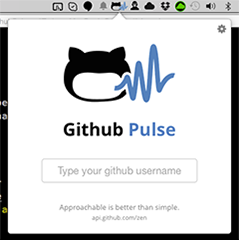
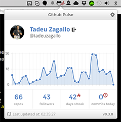

#  Github Pulse

Github Pulse is an app to help you keep your streaks, making a commit every day.

It shows a graph of your last month commits and how long is your current streak. Its icon also turns red if you haven't commited today yet, and by the end of the afternoon it'll remind you once, in case you still haven't commited.

## Installation

Right now it is available to OSX and Google Chrome

For OSX you can just download it [here](https://github.com/tadeuzagallo/GithubPulse/raw/master/dist/GithubPulse.zip), unzip and copy to your applications folder.

The Google Chrome Extension is avaiable on the [Chrome Web Store](https://chrome.google.com/webstore/detail/githubpulse/ppkickbgijieebbgfipephpafiiebapg) and if, for any reason, you want to download directly, it's also available [here](https://github.com/tadeuzagallo/GithubPulse/raw/master/dist/GithubPulse.crx.zip)

## What's being used

The OSX application has a small shell of native code, written in Swift and renders a React app (using JSX) on a WebView and uses `window.location` redirects to communicate with the native app.

The same react code is used for the Chrome Extension, just replacing the storage helpers and background workers.

### 3rd party libraries (Front)

* React
* Webpack
* Stylus
* Octicons
* react-router
* Chart.js

### Pods

* IYLoginItem
* INPopoverController

## Building it locally

As mentioned above I'm using Swift and React, so you'll need to have XCode 6+ installed, Node and CocoaPods already installed in order to build.

### To get started:

* Clone the repo: `$ git clone https://github.com/tadeuzagallo/GithubPulse.git`
* Install the npm dependencies: `$ npm install`
* Install the pods: `$ cd widget && pod install`. If you haven't used pod before, you will need to run `pod setup` first.

### Debug building

The debug build points the WebView to `webback-dev-server` default address: `localhost:8080`, so in order to get it running

* Start the webpack dev server: `$ cd front && webpack-dev-server`
* Just build the app through XCode interface (Command line build step is yet to come)

### Release building

__NOTICE__: If you just cloned the repo and wants `make` it, you'll have to open the file `widget/GithubPulse.xcworkspace` on XCode at least once for the build to succeed.

Just run `$ make osx` and the file `GithubPulse.zip` will be placed inside the `dist` directory.

### Chrome Extension

You can build de front end code with `$ make chrome`, I'm still packing the extension manually though...

## Credits and Motivation

I really believe commiting every day on an open source project is the best practice a developer can keep, so I made this project to show my love to Github and make I sure I never miss a commit! :D
